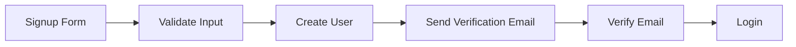
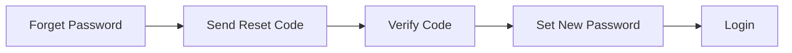

# Next.js Authentication System

A comprehensive, production-ready authentication system built with Next.js 14, TypeScript, MongoDB, and JWT. This system provides a complete authentication flow with email verification, password reset, and role-based access control.


## Features

### Authentication
- 🔐 Secure user registration with email verification
- 📧 Email-based password reset flow
- 🔑 JWT-based authentication with access and refresh tokens
- 🛡️ Role-based access control (User, Admin)
- 🔒 Protected routes and API endpoints
- 🎨 Modern, responsive UI with dark mode support

### Security
- 🔒 HTTP-only cookies for token storage
- 🔑 Password hashing with bcrypt
- 🚫 Rate limiting (configurable)
- 🛡️ CSRF protection
- ✉️ Secure email verification system
- 🔄 Automatic token refresh

### User Experience
- 📱 Responsive design
- 🌓 Dark/Light mode
- 💪 Password strength indicator
- ⚡ Real-time form validation
- 🎯 Clear error messages
- 🔄 Loading states

## Tech Stack

- **Framework**: Next.js 14 (App Router)
- **Language**: TypeScript
- **Database**: MongoDB
- **Authentication**: JWT (jsonwebtoken)
- **Styling**: Tailwind CSS
- **UI Components**: shadcn/ui
- **Form Handling**: React Hook Form
- **Validation**: Zod
- **Email**: Brevo (formerly Sendinblue)

## Quick Start

### Prerequisites
- Node.js 18+ 
- MongoDB database
- Brevo account for email service

### Installation

1. Clone the repository:
```bash
git clone https://github.com/Haseeb-WebDeveloper/complete-role-base-auth-system
cd complete-role-base-auth-system
```

2. Install dependencies:
```bash
npm install
# or
yarn install
```

3. Set up environment variables:
```env
# Create a .env file with the following variables
MONGODB_URI=your_mongodb_connection_string
SMTP_USER=your_brevo_smtp_user
SMTP_PASS=your_brevo_smtp_password
SENDER_EMAIL=your_verified_sender_email
JWT_ACCESS_TOKEN_SECRET=your_jwt_access_token_secret
JWT_REFRESH_TOKEN_SECRET=your_jwt_refresh_token_secret
JWT_RESET_TOKEN_SECRET=your_jwt_reset_token_secret
```

4. Run the development server:
```bash
npm run dev
# or
yarn dev
```

## Authentication Flow

### 1. Signup Flow


### 2. Password Reset Flow


### 3. Protected Routes
- Middleware checks for valid JWT
- Automatic token refresh
- Role-based access control

## API Routes

### Authentication Endpoints

```typescript
POST /api/auth/signup
POST /api/auth/login
POST /api/auth/logout
POST /api/auth/refresh
GET  /api/auth/me
POST /api/auth/forget-password
POST /api/auth/verify-email
POST /api/auth/reset-password
```

### Request/Response Examples

#### Signup
```typescript
// Request
POST /api/auth/signup
{
  "name": "John Doe",
  "email": "john@example.com",
  "password": "SecurePass123!"
}

// Response
{
  "success": true,
  "message": "User created successfully",
  "user": {
    "name": "John Doe",
    "email": "john@example.com",
    "role": "user"
  }
}
```

## Security Considerations

1. **Password Security**:
   - Minimum 8 characters
   - Must contain uppercase, lowercase, and numbers
   - Hashed using bcrypt

2. **JWT Configuration**:
   - Access Token: 1 hour expiry
   - Refresh Token: 7 days expiry
   - Reset Token: 15 minutes expiry

3. **Cookie Security**:
   - HTTP-only cookies
   - Secure flag in production
   - SameSite policy

## Customization

### Adding New Roles
```typescript
// Update user.model.ts
const userSchema = new mongoose.Schema({
  role: {
    type: String,
    enum: ["user", "admin", "custom_role"],
    default: "user"
  }
});
```

### Modifying Email Templates
```typescript
// Update src/template/index.ts
export const verifyMailMessage = (code: string) => `
  // Your custom HTML template
`;
```

## Contributing

Contributions are welcome! Please read our [Contributing Guide](CONTRIBUTING.md) for details on our code of conduct and the process for submitting pull requests.

## License

This project is licensed under the MIT License - see the [LICENSE](LICENSE) file for details.

## Support

If you find this project helpful, please give it a ⭐️ on GitHub!

## Authors

- Your Name - Initial work - [GitHub Profile](https://github.com/Haseeb-WebDeveloper)

## Acknowledgments

- [Next.js Team](https://nextjs.org)
- [Shadcn UI](https://ui.shadcn.com)
- [MongoDB](https://www.mongodb.com)

